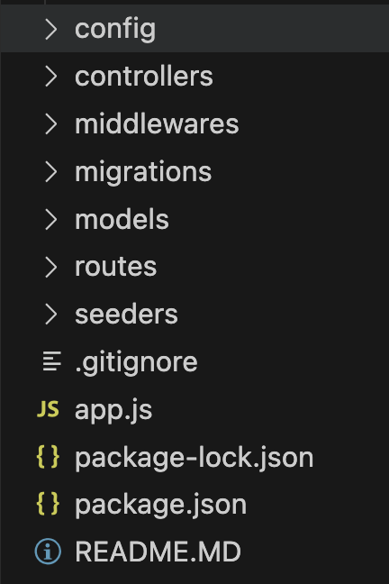

# My Todo APP
Pada Tugas ini, kalian diminta untuk melanjutkan server todo app pada week sebelumnya dengan menambahkan penyimpanan database postgresql.

## Direction
### 1. Struktur folder

Pada project ini kalian diminta untuk memisahkan logic pada repository kode kalian minimal seperti gambar di bawah ini.

- Folder config : berisi config setup database
- Folder controllers: berisi logic untuk memproses request dari client.
- Folder migrations : berisi historikal perubahan/penambahan/penghapusan table pada database
- Folder models : berisi file yang merepresentasikan entitas table di database
- Folder routes : berisi file yang  routing endpoint

### 2. ERD Todos

nama table: Todo (Bisa plural/singular)
kolom:
    - id PRIMARY KEY INTEGER NOT NULL
    - description STRING/TEXT NOT NULL
    - status ENUM NOT NULL (ENUM: ["created", "in_progress", "done"])
    - createdAt DATE NOT NULL
    - updatedAt: DATE NULL
    ** catatan untuk penamaan kolom pada todos diperbolehkan untuk camelCase atau snake_case, namun perlu diperhatikan konsistensi untuk input body request dan response.

### 3. ENDPOINT
Untuk detail endpoint requirement dapat dilihat pada folder assets/api-doc.md dan assets/postman.json
